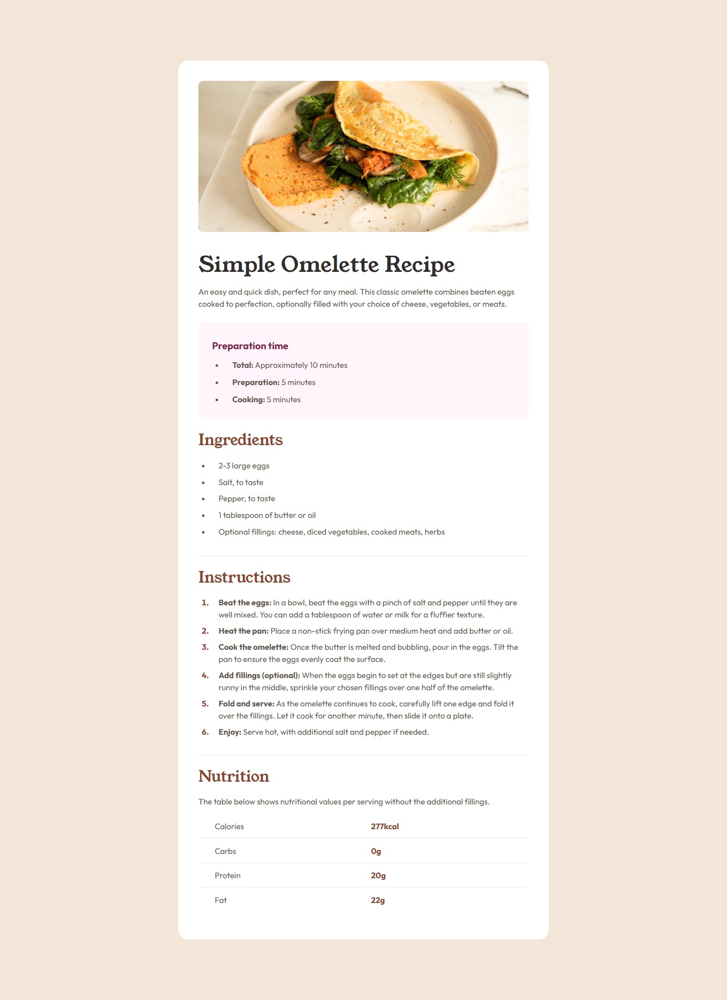
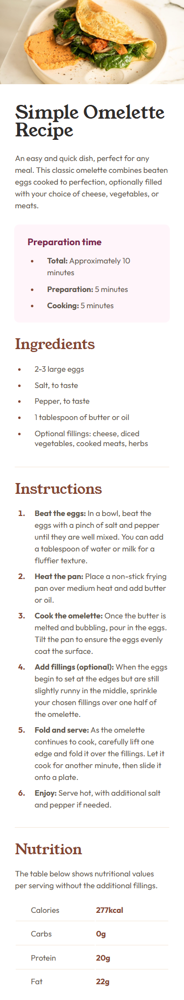

# Frontend Mentor - Recipe page solution

This is a solution to the [Recipe page challenge on Frontend Mentor](https://www.frontendmentor.io/challenges/recipe-page-KiTsR8QQKm). Frontend Mentor challenges help you improve your coding skills by building realistic projects. 

## Table of contents

- [Overview](#overview)
  - [The challenge](#the-challenge)
  - [Screenshot](#screenshot)
  - [Links](#links)
- [My process](#my-process)
  - [Built with](#built-with)
  - [What I learned](#what-i-learned)
  - [Continued development](#continued-development)
  - [Useful resources](#useful-resources)
- [Author](#author)
- [Acknowledgments](#acknowledgments)

## Overview

### Screenshot

<!-- 
 -->

### Links

- Solution URL: [https://github.com/ErwiniaDev/FrontendMentor_RecipePage](https://github.com/ErwiniaDev/FrontendMentor_RecipePage)
- Live Site URL: [https://erwiniadev.github.io/FrontendMentor_RecipePage/](https://erwiniadev.github.io/FrontendMentor_RecipePage/)

## My process

### Built with

- Semantic HTML5 markup
- CSS custom properties
- Flexbox

### What I learned

Table revision.
Mobile first!

### Continued development

OLD - I still have differences with spaces (paddings, margins, ...), used blocs and units I think.
EDIT - I have corrected the spaces, but I have coded the mobile and desktop versions separately... And I'm not sure that is optimal. I hope I haven't duplicated code... And I always hesitate for the choice of the units (rem, px, ...).

### Useful resources

- still the Modern CSS Reset of Andy Bell : https://dev.to/hankchizljaw/a-modern-css-reset-6p3

## Author

Frontend Mentor - [@ErwiniaDev](https://www.frontendmentor.io/profile/ErwiniaDev)

## Acknowledgments

Thank you to all the users who come to my contribution to give their feedback.
Have a nice day!
